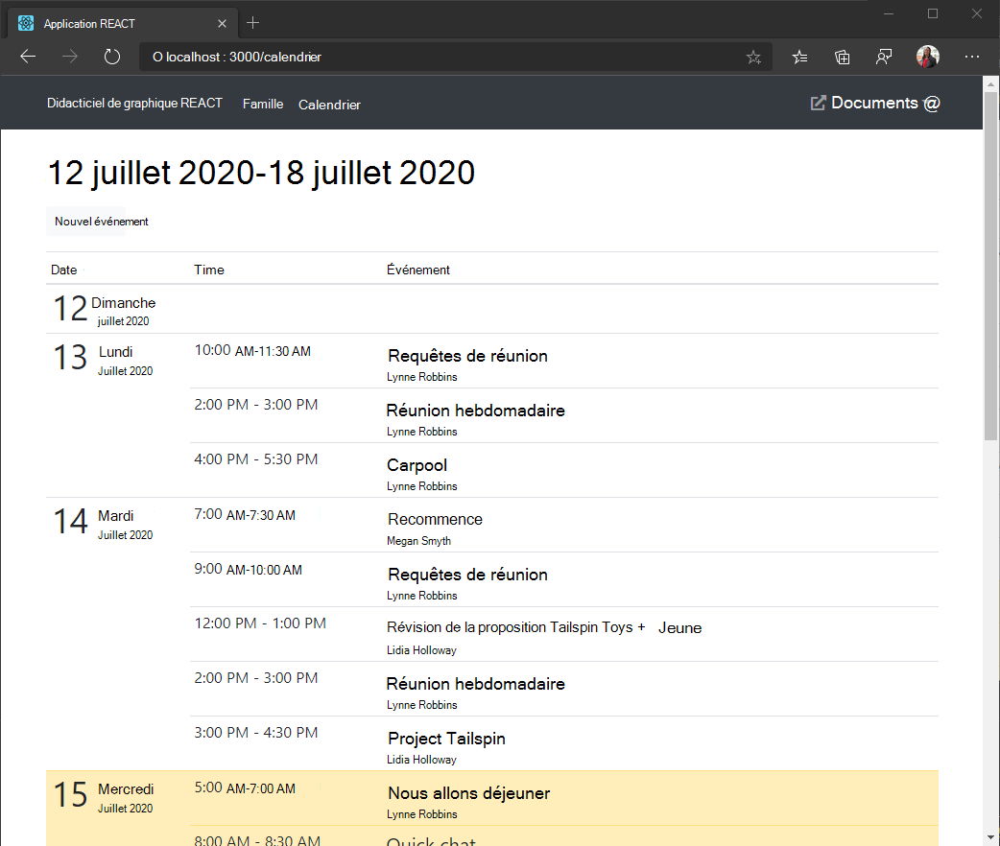

<!-- markdownlint-disable MD002 MD041 -->

Dans cet exercice, vous allez incorporer le Graph Microsoft dans l'application. Pour cette application, vous allez utiliser la bibliothèque [cliente microsoft-graph-client](https://github.com/microsoftgraph/msgraph-sdk-javascript) pour appeler Microsoft Graph.

## <a name="get-calendar-events-from-outlook"></a>Récupérer les événements de calendrier à partir d’Outlook

1. Ouvrez `./src/GraphService.ts` et ajoutez la fonction suivante.

    :::code language="typescript" source="../demo/graph-tutorial/src/GraphService.ts" id="getUserWeekCalendarSnippet":::

    Que fait ce code ?

    - L’URL qui sera appelée est `/me/calendarview`.
    - La méthode ajoute l'en-tête à la demande, ce qui entraîne la place des heures dans la réponse dans le fuseau horaire préféré de `header` `Prefer: outlook.timezone=""` l'utilisateur.
    - La méthode ajoute les paramètres et définit la fenêtre de temps `query` `startDateTime` pour `endDateTime` l'affichage Calendrier.
    - La méthode limite les champs renvoyés pour chaque événement à ceux que `select` l'affichage utilisera réellement.
    - La méthode trie les résultats par date et heure de création, l'élément le plus `orderby` récent étant le premier.
    - La `top` méthode limite les résultats d'une seule page à 25 événements.
    - Si la réponse contient une valeur, indiquant que d'autres résultats sont disponibles, un objet est utilisé pour passer en page dans la collection afin d'obtenir `@odata.nextLink` `PageIterator` tous les résultats. [](https://docs.microsoft.com/graph/sdks/paging?tabs=typeScript)

1. Créez un React pour afficher les résultats de l'appel. Créez un fichier dans `./src` le répertoire nommé et `Calendar.tsx` ajoutez le code suivant.

    ```typescript
    import React from 'react';
    import { NavLink as RouterNavLink } from 'react-router-dom';
    import { Table } from 'reactstrap';
    import moment, { Moment } from 'moment-timezone';
    import { findIana } from "windows-iana";
    import { Event } from 'microsoft-graph';
    import { config } from './Config';
    import { getUserWeekCalendar } from './GraphService';
    import withAuthProvider, { AuthComponentProps } from './AuthProvider';

    interface CalendarState {
      eventsLoaded: boolean;
      events: Event[];
      startOfWeek: Moment | undefined;
    }

    class Calendar extends React.Component<AuthComponentProps, CalendarState> {
      constructor(props: any) {
        super(props);

        this.state = {
          eventsLoaded: false,
          events: [],
          startOfWeek: undefined
        };
      }

      async componentDidUpdate() {
        if (this.props.user && !this.state.eventsLoaded)
        {
          try {
            // Get the user's access token
            var accessToken = await this.props.getAccessToken(config.scopes);

            // Convert user's Windows time zone ("Pacific Standard Time")
            // to IANA format ("America/Los_Angeles")
            // Moment needs IANA format
            var ianaTimeZones = findIana(this.props.user.timeZone);

            // Get midnight on the start of the current week in the user's timezone,
            // but in UTC. For example, for Pacific Standard Time, the time value would be
            // 07:00:00Z
            var startOfWeek = moment.tz(ianaTimeZones![0].valueOf()).startOf('week').utc();

            // Get the user's events
            var events = await getUserWeekCalendar(accessToken, this.props.user.timeZone, startOfWeek);

            // Update the array of events in state
            this.setState({
              eventsLoaded: true,
              events: events,
              startOfWeek: startOfWeek
            });
          }
          catch (err) {
            this.props.setError('ERROR', JSON.stringify(err));
          }
        }
      }

      render() {
        return (
          <pre><code>{JSON.stringify(this.state.events, null, 2)}</code></pre>
        );
      }
    }

    export default withAuthProvider(Calendar);
    ```

    Pour l'instant, cela restituera simplement le tableau des événements dans JSON sur la page.

1. Ajoutez ce nouveau composant à l'application. Ouvrez `./src/App.tsx` et ajoutez l'instruction `import` suivante en haut du fichier.

    ```typescript
    import Calendar from './Calendar';
    ```

1. Ajoutez le composant suivant juste après le composant `<Route>` existant.

    ```typescript
    <Route exact path="/calendar"
      render={(props) =>
        this.props.isAuthenticated ?
          <Calendar {...props} /> :
          <Redirect to="/" />
      } />
    ```

1. Enregistrez vos modifications, puis redémarrez l’application. Connectez-vous et cliquez **sur le lien** Calendrier dans la barre de navigation. Si tout fonctionne, vous devriez voir une image mémoire JSON des événements dans le calendrier de l’utilisateur.

## <a name="display-the-results"></a>Afficher les résultats

Vous pouvez maintenant mettre à jour `Calendar` le composant pour afficher les événements d'une manière plus conviviale.

1. Créez un fichier dans `./src` le répertoire nommé et `Calendar.css` ajoutez le code suivant.

    :::code language="css" source="../demo/graph-tutorial/src/Calendar.css":::

1. Créez un React pour restituer les événements en une seule journée en tant que lignes de tableau. Créez un fichier dans `./src` le répertoire nommé et `CalendarDayRow.tsx` ajoutez le code suivant.

    :::code language="typescript" source="../demo/graph-tutorial/src/CalendarDayRow.tsx" id="CalendarDayRowSnippet":::

1. Ajoutez les `import` instructions suivantes en haut **de Calendar.tsx**.

    ```typescript
    import CalendarDayRow from './CalendarDayRow';
    import './Calendar.css';
    ```

1. Remplacez la fonction `render` existante par la fonction `./src/Calendar.tsx` suivante.

    :::code language="typescript" source="../demo/graph-tutorial/src/Calendar.tsx" id="renderSnippet":::

    Cela divise les événements en jours respectifs et rend une section de tableau pour chaque jour.

1. Enregistrez les modifications et redémarrez l'application. Cliquez sur le **lien Calendrier** et l'application doit maintenant restituer une table des événements.

    
